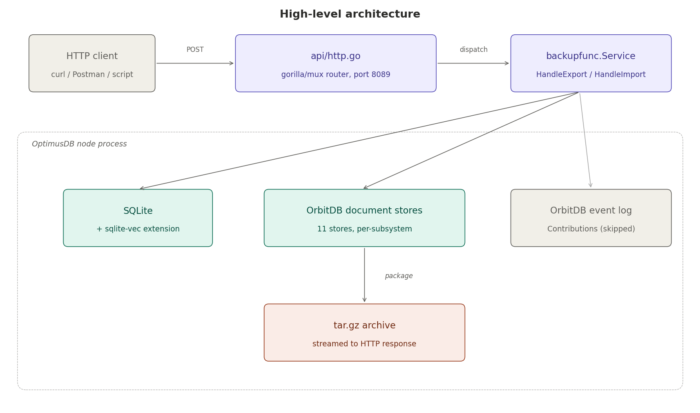
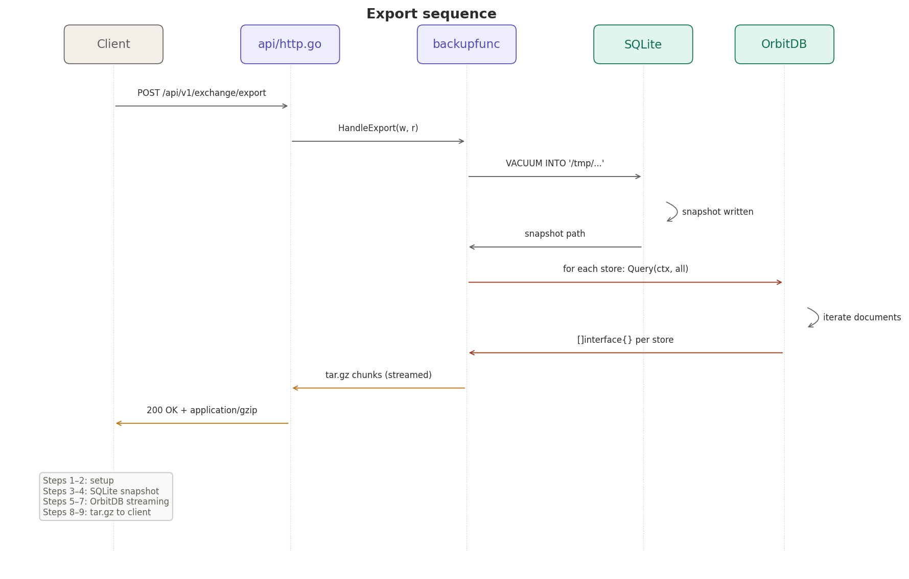
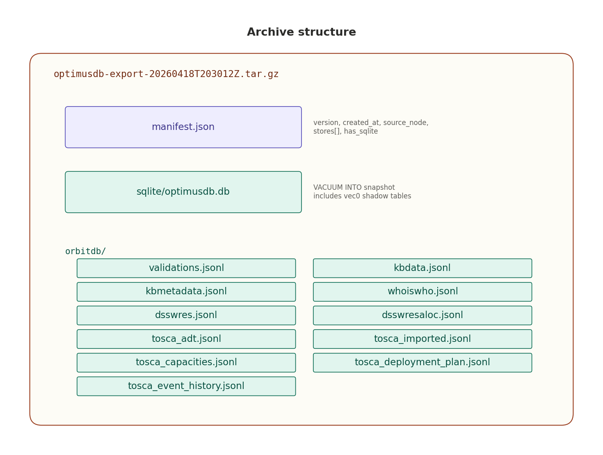
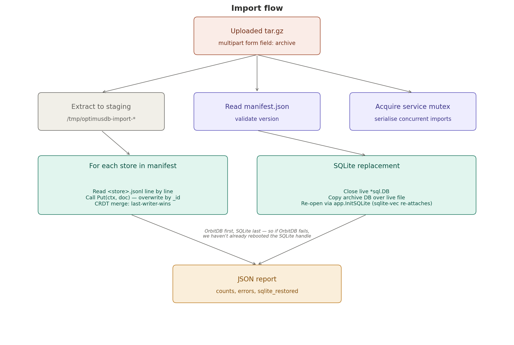

# OptimusDB Exchange — Data Store Backup & Restore

> Export the full state of an OptimusDB node as a single portable archive and restore it back — over REST, with one HTTP call per direction.

## Table of contents

1. [What this is](#what-this-is)
2. [Architecture overview](#architecture-overview)
3. [What gets exported](#what-gets-exported)
4. [What "overwrite" means on import](#what-overwrite-means-on-import)
5. [Archive format](#archive-format)
6. [Testing it — step by step](#testing-it--step-by-step)
7. [Operational caveats](#operational-caveats)
8. [Troubleshooting](#troubleshooting)
9. [Design decisions](#design-decisions)

---

## What this is

OptimusDB manages three kinds of state on every node:

- **A SQLite database** — holds the relational data catalog, metadata records, TOSCA metadata, and the `sqlite-vec` vector index used by semantic search.
- **Multiple OrbitDB document stores** — eleven of them, one per subsystem (validations, knowledge base data, knowledge base metadata, solar/wind resources, TOSCA templates, and so on).
- **An OrbitDB event log** — the append-only contribution log.

The **backup & restore feature** (`backupfunc` package + two new REST endpoints) lets an operator:

- Capture the full SQLite database and every live OrbitDB document store in a single `.tar.gz` with one HTTP request.
- Restore that archive back into the same node — or a different node — with a second HTTP request.
- Move data between nodes for disaster recovery, environment promotion (dev → staging → prod), or forking a development environment from a known snapshot.

It is **not**:

- A scheduler (use cron or Kubernetes CronJobs against the REST endpoint).
- A replication mechanism (OrbitDB already handles peer-to-peer replication via LibP2P).
- A partial / selective export (full node state only, for now).
- Cryptographically signed or encrypted (wrap the archive yourself with `gpg` or `age` if transport isn't already secured).

---

## Architecture overview



The `backupfunc.Service` is constructed once at node startup and attached to the shared `KnowledgeBaseDB` struct, following the same pattern used by the semantic search index. Two new routes — `POST /api/v1/exchange/export` and `POST /api/v1/exchange/import` — are registered on the existing `gorilla/mux` router that already serves `/api/v1/metadata/*`, `/api/v1/chat/*`, and `/api/v1/semantic/*`.

The service reaches directly into the live SQLite handle and the live OrbitDB document store pointers. It does **not** open its own connections or talk to the peer network. This keeps the implementation simple, and it guarantees consistency with whatever other subsystem is writing to those stores — because every subsystem (including backup) goes through the same handles.

The **OrbitDB event log** (`Contributions`) is deliberately skipped. Event logs are append-only with no `_id` addressing, so replaying entries one-by-one on the receiving side creates new entries rather than restoring the original log. Exporting it would be misleading.

---

## What gets exported

| Store | Type | Exported? | Restored how? |
|---|---|---|---|
| SQLite (`*.db`) | Relational + sqlite-vec | Yes | File-level replace via `VACUUM INTO` → copy → reopen |
| `validations` | OrbitDB DocumentStore | Yes | `Put(doc)` per document |
| `kbdata` | OrbitDB DocumentStore | Yes | `Put(doc)` per document |
| `kbmetadata` | OrbitDB DocumentStore | Yes | `Put(doc)` per document |
| `whoiswho` | OrbitDB DocumentStore | Yes | `Put(doc)` per document |
| `dsswres` | OrbitDB DocumentStore | Yes | `Put(doc)` per document |
| `dsswresaloc` | OrbitDB DocumentStore | Yes | `Put(doc)` per document |
| `tosca_adt` | OrbitDB DocumentStore | Yes | `Put(doc)` per document |
| `tosca_imported` | OrbitDB DocumentStore | Yes | `Put(doc)` per document |
| `tosca_capacities` | OrbitDB DocumentStore | Yes | `Put(doc)` per document |
| `tosca_deployment_plan` | OrbitDB DocumentStore | Yes | `Put(doc)` per document |
| `tosca_event_history` | OrbitDB DocumentStore | Yes | `Put(doc)` per document |
| `Contributions` | OrbitDB **EventLogStore** | **No** | (not possible without breaking log's hash chain) |
| LibP2P identity key | Private key file | **No** | (would let receiver impersonate the source node) |
| `~/.cache/optimusdb/.../orbitdb/` blockstore | IPFS blocks | **No** | (re-fetched via replication when heads propagate) |

Stores that are `nil` on the node at export time (because their subsystem isn't initialised) are silently skipped. Export is **best-effort over whatever is live** — it never fails because a subsystem happens to be disabled.

---

## Export flow



The export sequence is:

1. **Client** sends `POST /api/v1/exchange/export`.
2. **`api/http.go`** checks that `kb.ExchangeService` is non-nil and dispatches to `backupfunc.Service.HandleExport`.
3. **Acquire service mutex** (serialises concurrent exports and blocks a racing import).
4. **SQLite snapshot**: `VACUUM INTO` writes a consistent copy of the database to a fresh temp file. This is safe while other requests are reading or writing — SQLite holds a brief read lock, and the snapshot includes `sqlite-vec` shadow tables verbatim.
5. **OrbitDB iteration**: for each non-nil document store, `Query(ctx, filter-all)` returns every live document. Results are JSON-encoded, one per line, into an in-memory buffer per store.
6. **Stream archive**: `manifest.json` → `sqlite/optimusdb.db` → one `orbitdb/<name>.jsonl` per store, all wrapped in a `tar.gz` that streams directly into the HTTP response body. Nothing is buffered in memory except the per-store document list.
    7. **Client** receives `application/gzip` with `Content-Disposition: attachment; filename="optimusdb-export-<UTC timestamp>.tar.gz"`.

        Export does not block normal request traffic in any meaningful way. `VACUUM INTO` takes a brief read lock; OrbitDB `Query` does not lock writers.

        ---

        ## Archive format

        

        Every archive contains exactly three kinds of entries:

        - **`manifest.json`** at the top level. Always read first by the importer. Contains version (currently `"1"`), creation timestamp, source node ID, the list of stores included, and a flag for whether SQLite is included.
        - **`sqlite/optimusdb.db`** — a full binary SQLite file. Because `VACUUM INTO` preserves all schemas, indexes, triggers, and `sqlite-vec` virtual-table shadow data, this single file is enough to reconstruct the entire relational side of the node.
        - **`orbitdb/<store>.jsonl`** — one JSONL file per exported document store. Each line is a complete JSON-encoded document. A store that exists but contains zero documents becomes an empty file (still listed in the manifest).

            The archive is `tar.gz` — the most universally available compressed-archive format, openable on every Unix-like system, every container base image, and by `tar` on recent Windows.

            You can inspect an archive without extracting it:

            ```bash
            # List contents
            tar -tzvf optimusdb-export-20260418T203012Z.tar.gz

            # Read manifest only
            tar -xzOf optimusdb-export-20260418T203012Z.tar.gz manifest.json | jq .

            # Peek at a single store's contents
            tar -xzOf optimusdb-export-20260418T203012Z.tar.gz orbitdb/dsswres.jsonl | jq -c '. | {_id, name: .name // .template_name}' | head
            ```

            ---

            ## What "overwrite" means on import

            

            The import sequence runs **OrbitDB first, SQLite last**. This ordering is deliberate: if OrbitDB import fails partway through, the live SQLite handle has not yet been rebooted, so the node remains fully usable for everything except whichever OrbitDB stores had already been partially imported.

            ### OrbitDB overwrite semantics

            For each document in an incoming `.jsonl` file, `backupfunc` calls the document store's `Put` method. Putting a document with an `_id` that already exists in the store causes OrbitDB to write a new OpLog entry; the CRDT merge layer then resolves the conflict using **last-writer-wins by Lamport clock**. Because the imported write is the most recent, the imported document wins locally.

            When OpLog heads propagate to peers (via the existing LibP2P replication the node already runs), other peers converge to the same document — the import effectively broadcasts the change across the swarm.

            **Practical implication:** an imported archive is *additive and authoritative*. Anything in the receiving node's OrbitDB stores that is also in the archive gets replaced. Anything in the receiving node's stores that is **not** in the archive is left untouched. If you want a true "wipe and reload" for OrbitDB, delete the receiving node's OrbitDB data directory before import.

            ### SQLite overwrite semantics

            SQLite is replaced at the file level — there is no row-by-row merge. Specifically:

            1. The live `*sql.DB` handle is closed.
            2. The `optimusdb.db` file from the archive is copied over the live file on disk.
            3. `app.InitSQLite` is called again. This re-registers the custom `sqlite3_vec_kb` driver hook (needed for `sqlite-vec`), re-opens the file, and re-runs the `CREATE IF NOT EXISTS` and migration steps against the new database.

            **Practical implication:** SQLite import is a **total replace**. Anything in the receiving node's SQLite that is not in the archive is gone. This is the normal expectation for SQLite backup/restore, but it's worth being explicit about.

            ---

            ## Testing it — step by step

            All examples assume the default port `8089`. Adjust to match your `--http-port` flag.

            ### Sanity check — are the routes registered?

            After rebuilding and starting the node, the startup log should contain:

            ```
            [EXCHANGE] Service initialized — routes live at /api/v1/exchange/{export,import}
            [EXCHANGE] Routes registered at /api/v1/exchange/{export,import}
            ```

            The first line is from `main.go` (service constructed); the second is from `api/http.go` (routes wired). If both appear, you're good.

            ### Test 1 — Round-trip on the same node

            This is the most useful smoke test. Because OrbitDB overwrite is idempotent under last-writer-wins, importing the node's own recent export back into itself should succeed with zero changes of consequence.

            ```bash
            # 1. Export
            curl -X POST http://localhost:8089/api/v1/exchange/export \
            --output /tmp/optimusdb.tar.gz

            # 2. Verify the archive is well-formed
            tar -tzvf /tmp/optimusdb.tar.gz | head -20
            tar -xzOf /tmp/optimusdb.tar.gz manifest.json | jq .

            # 3. Import back — should return a clean JSON report
            curl -X POST http://localhost:8089/api/v1/exchange/import \
            -F "archive=@/tmp/optimusdb.tar.gz" | jq .
            ```

            Expected import response (counts will vary):

            ```json
            {
            "sqlite_restored": true,
            "stores": {
            "validations": 12,
            "kbdata": 4,
            "kbmetadata": 8,
            "dsswres": 142,
            "dsswresaloc": 3,
            "tosca_imported": 8,
            "tosca_adt": 2,
            "tosca_capacities": 2,
            "tosca_deployment_plan": 1,
            "tosca_event_history": 5,
            "whoiswho": 1
            },
            "errors": []
            }
            ```

            ### Test 2 — Migrating data between two nodes

            Typical use case: promote a dev node's state to staging, or copy a production snapshot down to a local machine for debugging.

            ```bash
            # On the source node
            curl -X POST http://node-a.example:8089/api/v1/exchange/export \
            --output /tmp/nodeA-snapshot.tar.gz

            # Ship the archive to wherever (SCP, S3, physical media, etc.)
            scp /tmp/nodeA-snapshot.tar.gz user@node-b.example:/tmp/

            # On the destination node
            ssh user@node-b.example
            curl -X POST http://localhost:8089/api/v1/exchange/import \
            -F "archive=@/tmp/nodeA-snapshot.tar.gz" | jq .
            ```

            Two things to know when migrating:

            - **Identity is not copied.** The destination node keeps its own LibP2P peer ID. It will replicate to other peers as itself, not as the source node.
            - **IPFS blocks are not in the archive.** They re-hydrate from the swarm automatically once OpLog heads propagate and peers fetch missing blocks.

            ### Test 3 — Inspecting an archive without a node

            Sometimes you want to look at an archive without importing it — e.g., to diff two exports, or to verify what's actually in a snapshot before restoring.

            ```bash
            # List all files
            tar -tzvf /tmp/optimusdb.tar.gz

            # Read the manifest
            tar -xzOf /tmp/optimusdb.tar.gz manifest.json | jq .

            # Count documents per store
            for store in $(tar -xzOf /tmp/optimusdb.tar.gz manifest.json | jq -r '.stores[]'); do
            count=$(tar -xzOf /tmp/optimusdb.tar.gz "orbitdb/${store}.jsonl" 2>/dev/null | wc -l)
            printf "%-28s %6d docs\n" "$store" "$count"
            done

            # Look at a specific document by _id
            tar -xzOf /tmp/optimusdb.tar.gz orbitdb/tosca_imported.jsonl \
            | jq -c 'select(._id == "tosca_my_template_v1.0")'

            # Extract just the SQLite file for offline inspection
            mkdir -p /tmp/inspect
            tar -xzf /tmp/optimusdb.tar.gz -C /tmp/inspect sqlite/optimusdb.db
            sqlite3 /tmp/inspect/sqlite/optimusdb.db ".tables"
            sqlite3 /tmp/inspect/sqlite/optimusdb.db "SELECT COUNT(*) FROM metadata_catalog"
            ```

            ### Test 4 — Simulated disaster recovery

            Verify that an archive alone is enough to fully rebuild a node's state from scratch:

            ```bash
            # 1. Take a known-good snapshot
            curl -X POST http://localhost:8089/api/v1/exchange/export \
            --output /tmp/known-good.tar.gz

            # 2. Stop the node and wipe its data directory
            #    (Adjust path to match your --repo flag; default is "swarmkbIpfs")
            systemctl stop optimusdb   # or kubectl rollout restart, docker stop, etc.
            rm -rf ~/.cache/optimusdb/swarmkbIpfs

            # 3. Start the node with a clean state
            systemctl start optimusdb

            # 4. Wait for it to come up, then import the snapshot
            sleep 30
            curl -X POST http://localhost:8089/api/v1/exchange/import \
            -F "archive=@/tmp/known-good.tar.gz" | jq .

            # 5. Verify data is back
            curl -X GET "http://localhost:8089/swarmkb/inventory"
            ```

            ---

            ## Operational caveats

            ### Concurrency — what's safe, what's not

            - **Two concurrent exports**: the second one waits on the service mutex. Both succeed, one after the other.
            - **Concurrent export + import**: serialised. One waits for the other.
            - **Normal request traffic during export**: unaffected. `VACUUM INTO` briefly takes a read lock on SQLite; OrbitDB reads don't block writers.
            - **Normal request traffic during import**: **not** unaffected. While the SQLite file is being swapped, any request that touches the database will see "database is closed" for roughly a second. Don't import while the node is under load.

            ### No authentication

            The endpoints inherit whatever auth middleware is already on the `/api/v1/` router. If the rest of your API is unauthenticated today, these endpoints are also unauthenticated — and `export` exposes every document in the node. Put the node behind a network policy, a Kubernetes Ingress with basic auth, or similar **before** exposing the API port to the internet.

            ### Archive size

            A node with a few hundred documents and modest SQLite state produces a `.tar.gz` in the range of hundreds of KB to a few MB. Nodes with large TOSCA templates, or long-lived metadata catalogs with many indexed columns, can produce archives of tens to hundreds of MB. The handler streams the response, so archive size doesn't translate to memory pressure on the server.

            The default upload cap for import is **1 GB**. Above that, increase the `ParseMultipartForm` limit in the handler.

            ### The IPFS blockstore isn't in the archive

            OrbitDB data is replicated across peers through IPFS. A restored node will re-fetch missing IPFS blocks from other peers automatically as OpLog heads propagate. For a truly air-gapped restore (no peer network available), you'd need the IPFS `blocks/` directory alongside the archive — not supported in this first iteration.

            ---

            ## Troubleshooting

            | Symptom | Likely cause | Fix |
            |---|---|---|
            | `503 Service Unavailable: exchange service not initialized` | Node started but wiring in `main.go` is missing or ran after a fatal error | Check startup logs for `[EXCHANGE] Service initialized`. If absent, check that `backupfunc.New(...)` is actually called. |
            | `404 Not Found` on the route | Build didn't pick up the new `api/http.go` changes | Rebuild the binary, not just the container layer. Docker layer cache can hide stale compiled code. |
            | `VACUUM INTO: database is locked` in export | Another very long-running write is holding SQLite | Rare, usually transient. Retry. If persistent, check for a hung SQL DML request. |
            | Import succeeds but semantic search returns empty results | Expected behaviour — the semantic index is reconstructed on the node's existing data path, not from the archive | Trigger a re-index: `POST /api/v1/semantic/index` (or whatever your index-refresh endpoint is) after import. |
            | Import succeeds but `errors: ["store X not open on this node"]` | Archive was made on a node that had store X enabled; destination doesn't | Expected — the document data is in the archive but there's no live store to receive it. Either enable store X on the destination, or ignore the warning. |
            | `put "my-id": key already exists` errors during import | **Should not happen** — `Put` is overwrite-by-`_id` in our usage | If this does appear, file a bug; it means the OrbitDB binding has changed semantics. |

            ---

            ## Design decisions

            A few choices are worth explaining for future maintainers.

            ### Why `VACUUM INTO` for SQLite, not row-by-row dump?

            The SQLite database contains `sqlite-vec` virtual tables with internal shadow tables (`_chunks`, `_rowids`, `_vector_chunks*`). Serialising those row-by-row would work but would require either re-running the semantic index pipeline on import (slow, and depends on llama-server being available) or reconstructing the vector index from scratch. `VACUUM INTO` gives a binary-level consistent snapshot of everything — schema, data, indexes, vec0 shadow tables — in one operation, and restores in one operation. Full fidelity, minimal code.

            ### Why JSONL per OrbitDB store, not binary OrbitDB export?

            OrbitDB stores its data in IPFS blocks (content-addressed, CID-referenced). Exporting the raw block tree would tie the archive to the IPFS repo layout and would be opaque without an IPFS daemon to read it. JSONL is human-readable, inspectable with `jq`, diff-friendly, and streams nicely. The tradeoff is that you lose the OpLog history — but you already have that in the swarm; a backup is primarily about restoring current state.

            ### Why "overwrite" as the only import policy?

            The earlier design iteration had `fail` / `merge` / `overwrite` as a selectable policy. In practice, the only policy that makes sense for a full-state archive is overwrite:

            - `fail` makes restoration impossible if there's any overlap.
            - `merge` produces an inconsistent state where SQLite is replaced but OrbitDB documents are skipped.
            - `overwrite` is predictable and matches what users actually want from "restore".

            Selective import (specific stores only, date ranges, etc.) was considered and deferred — it adds complexity without a concrete current use case. It can be added later without breaking the archive format.

            ### Why not a CLI tool?

            Everything the CLI would do, `curl` already does. Adding a CLI means another binary to build, another image layer to ship, another thing to keep in sync with the REST contract. For operators who want scripted invocation, a 3-line shell function calling `curl` is the same shape as a CLI command without any of the ongoing cost.

            ### Why no signing or encryption?

            Transport security (HTTPS at the ingress) handles in-flight protection. At-rest protection for archives stored on shared filesystems is a separate, more general concern — `gpg`, `age`, or filesystem-level encryption are all better solutions than rolling our own inside the archive format. Leaving the archive unencrypted keeps it inspectable (`jq`, `sqlite3`) without ceremony, and lets you pick whichever encryption layer fits your deployment.
