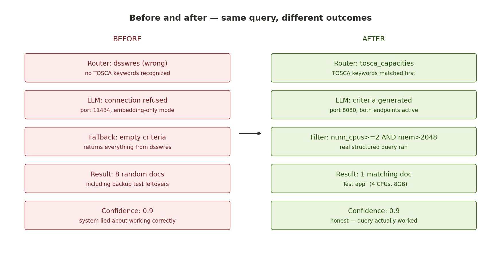
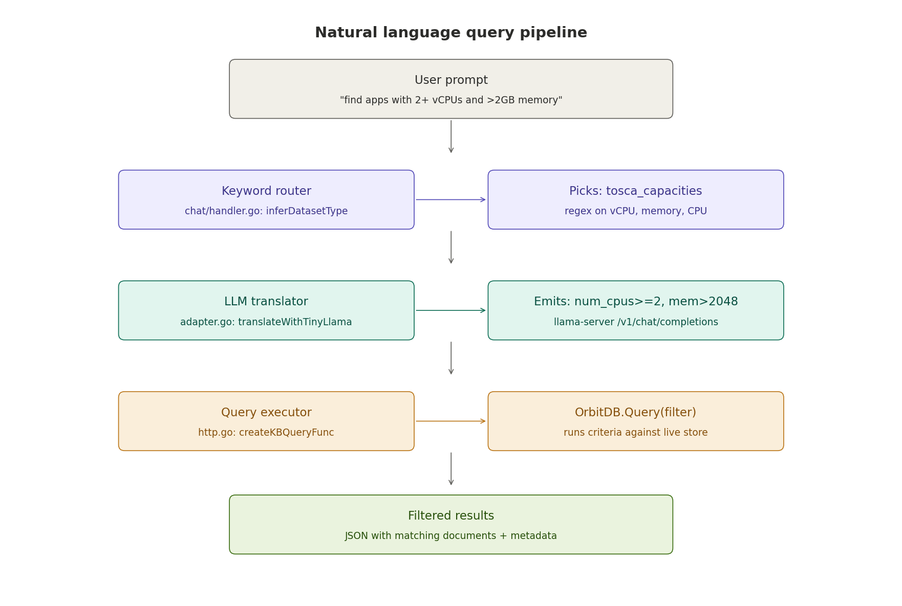
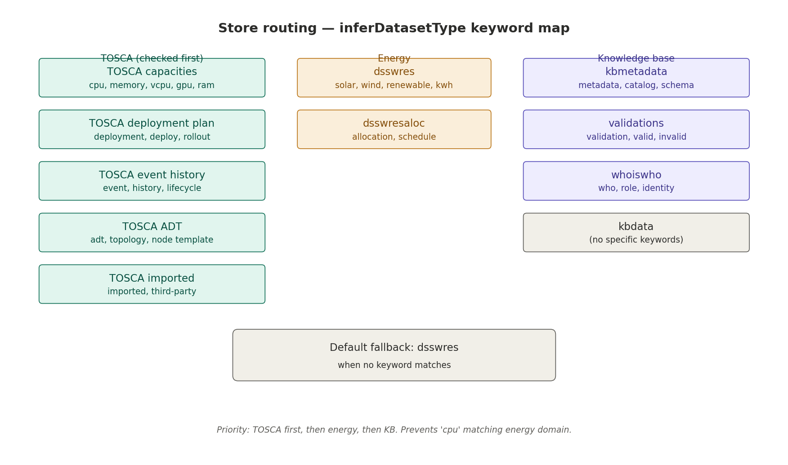
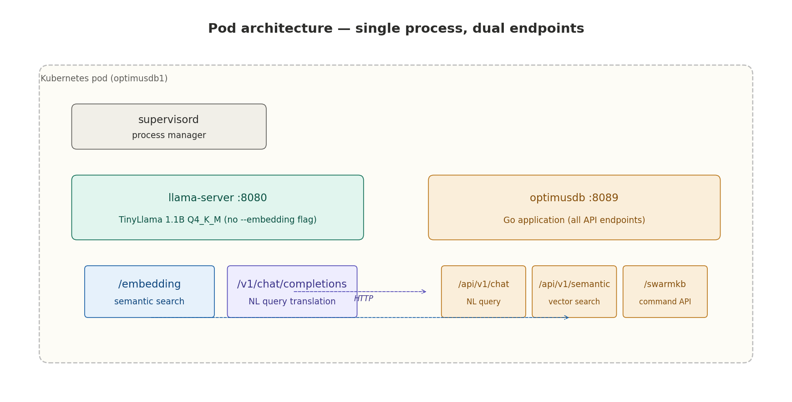

# OptimusDB — Natural language query pipeline

> **Feature status:** Deployed and verified, 19 April 2026
> **Cluster:** `epm-server`, Kubernetes namespace `optimusddc`, three agents (`optimusdb1`, `optimusdb2`, `optimusdb3`)
> **Endpoint:** `POST /api/v1/chat`
> **Related features:** Semantic search (`/api/v1/semantic/*`), Backup and restore (`/api/v1/exchange/*`)

## Table of contents

1. [What this feature does](#1-what-this-feature-does)
2. [Architecture](#2-architecture)
3. [How a query flows through the system](#3-how-a-query-flows-through-the-system)
4. [Store routing](#4-store-routing)
5. [API reference](#5-api-reference)
6. [Usage examples](#6-usage-examples)
7. [Infrastructure](#7-infrastructure)
8. [Files changed](#8-files-changed)
9. [Testing and verification](#9-testing-and-verification)
10. [Known limitations](#10-known-limitations)
11. [Troubleshooting](#11-troubleshooting)

---

## 1. What this feature does

OptimusDB's natural language query pipeline lets users ask questions in plain English and receive structured, filtered results from any of the 11 OrbitDB document stores in the system. A user types a sentence; the system translates it into a structured database query, executes it, and returns matching documents with full transparency about what query actually ran.

**Before this feature:** The `POST /api/v1/chat` endpoint existed but only knew about 4 of 11 stores, had no TOSCA awareness, and the LLM was unreachable due to a port/flag misconfiguration. Every query silently fell back to returning all documents from the wrong store with fake 90% confidence.

**After this feature:** The same endpoint correctly routes queries to the right store, translates natural-language constraints into structured filters via a live LLM, and returns only the documents that match — with honest metadata showing exactly what query was executed.



---

## 2. Architecture

The pipeline has four layers, each responsible for one transformation:



| Layer | Responsibility | Implementation |
|---|---|---|
| **Keyword router** | Picks which of 11 OrbitDB stores the question targets | `chat/handler.go` — `inferDatasetType()` |
| **LLM translator** | Converts natural language to structured criteria JSON | `chat/adapter.go` — `translateWithTinyLlama()` |
| **Query executor** | Binds to the OrbitDB store and runs the filter | `api/http.go` — `createKBQueryFunc()` |
| **Response formatter** | Renders results as readable text with metadata | `chat/handler.go` — `formatQueryResult()` |

Each layer is independent and can be tested in isolation. The keyword router doesn't depend on the LLM; the executor doesn't depend on the router; the formatter doesn't depend on the executor. This separation means a broken LLM degrades to "returns everything" rather than crashing the endpoint.

---

## 3. How a query flows through the system

Using the concrete example: *"find applications with at least 2 vCPUs and more than 2GB memory"*

### Step 1 — Routing

The router scans the lowercased message for domain-specific keywords. The words "vCPU" and "memory" match the TOSCA capacities pattern. Result: `dstype = "tosca_capacities"`.

### Step 2 — Translation

The message and the chosen dataset type are sent to llama-server at `http://localhost:8080/v1/chat/completions` with a system prompt that includes per-store field hints and worked examples. The LLM returns:

```json
{"command": "query", "criteria": [
{"field": "num_cpus", "operator": ">=", "value": 2},
{"field": "mem_size_mb", "operator": ">", "value": 2048}
]}
```

If the LLM is unreachable or returns unparseable output, `fallbackTranslation` produces best-effort criteria based on keyword matching (less accurate, but the system doesn't crash).

### Step 3 — Execution

The executor looks up `kb.DsTOSCA_Capacities` in the `createKBQueryFunc` switch, runs `OrbitDB.Query()` with a filter function that applies each criterion using numeric comparison operators (`>=`, `>`, `<`, `<=`, `==`, `!=`, `contains`).

### Step 4 — Response

The matching documents are formatted into a readable response. The metadata block is attached so the caller can see exactly what happened:

```json
{
"metadata": {
"query_type": "nlquery",
"dataset_type": "tosca_capacities",
"executed_cmd": "query",
"result_count": 1,
"confidence": 0.9
},
"response": "Found **1** result(s):\n\n**1.** Test app\n\n"
}
```

---

## 4. Store routing

The keyword router (`inferDatasetType` in `chat/handler.go`) uses regex patterns with word boundaries to pick the target store. TOSCA patterns are checked first to prevent collisions with energy-domain keywords.



### Routing rules

| Store | Matching keywords |
|---|---|
| `tosca_capacities` | tosca, vcpu, cpu, mem, memory, ram, gb, mb, vm, gpu |
| `tosca_deploymentplan` | deployment, deploy, deployed, rollout |
| `tosca_eventhistory` | event, history, timeline, lifecycle |
| `tosca_adt` | adt, node template, topology, policy |
| `tosca_imported` | imported, third-party |
| `dsswres` | solar, pv, photovoltaic, wind, turbine, renewable, kwh |
| `dsswresaloc` | allocation, schedule, reservation |
| `kbmetadata` | metadata, catalog, table, column, schema |
| `validations` | validation, validate, valid, invalid |
| `whoiswho` | who, role, identity, directory |
| `kbdata` | *(no specific keywords — reached via default or explicit mention)* |

**Priority order:** TOSCA first, then energy, then knowledge-base. This prevents queries like "find applications with 2 CPUs" from accidentally matching the energy domain.

**Default fallback:** If no keyword matches, the query goes to `dsswres` (configurable via `HandlerConfig.DefaultDataset`).

---

## 5. API reference

### POST /api/v1/chat

Accepts a natural language message and returns filtered results from the most relevant datastore.

**Request:**

```json
{
"message": "find applications with at least 2 vCPUs and more than 2GB memory",
"conversation_history": []
}
```

**Response:**

```json
{
"response": "Found **1** result(s):\n\n**1.** Test app\n\n",
"metadata": {
"query_type": "nlquery",
"dataset_type": "tosca_capacities",
"executed_cmd": "query",
"result_count": 1,
"confidence": 0.9
},
"timestamp": "2026-04-19T09:54:38Z"
}
```

**Metadata fields:**

| Field | Description |
|---|---|
| `query_type` | Always `"nlquery"` for data queries. Other values: `"greeting"`, `"help"`, `"schema"`, `"list_datasets"` |
| `dataset_type` | Which OrbitDB store was queried |
| `executed_cmd` | `"query"` if criteria were applied, `"get"` if all documents were retrieved |
| `result_count` | Number of documents matching the criteria |
| `confidence` | 0.0–1.0 score. 0.9 = query ran successfully. 0.5 = zero results. 0.3 = error occurred |

### GET /api/v1/chat/health

Returns the health status of the chat subsystem.

```json
{
"status": "healthy",
"service": "chat",
"assistant": "OptimusDB Assistant",
"tinyllama": "http://localhost:8080/v1/chat/completions",
"timestamp": "2026-04-19T09:54:35Z"
}
```

---

## 6. Usage examples

### List all documents in a store

```bash
curl -sS -X POST http://193.225.250.240/optimusdb1/api/v1/chat \
-H 'Content-Type: application/json' \
-d '{"message": "show me all TOSCA capacity profiles"}' | jq .
```

### Filter by numeric criteria

```bash
curl -sS -X POST http://193.225.250.240/optimusdb1/api/v1/chat \
-H 'Content-Type: application/json' \
-d '{"message": "find applications with at least 2 vCPUs and more than 2GB memory"}' | jq .
```

### Query energy-domain data

```bash
curl -sS -X POST http://193.225.250.240/optimusdb1/api/v1/chat \
-H 'Content-Type: application/json' \
-d '{"message": "show me solar installations in Greece"}' | jq .
```

### Query metadata catalog

```bash
curl -sS -X POST http://193.225.250.240/optimusdb1/api/v1/chat \
-H 'Content-Type: application/json' \
-d '{"message": "list catalog metadata entries"}' | jq .
```

### Check available datasets

```bash
curl -sS -X POST http://193.225.250.240/optimusdb1/api/v1/chat \
-H 'Content-Type: application/json' \
-d '{"message": "what datasets are available?"}' | jq .
```

---

## 7. Infrastructure

### Pod architecture



Each OptimusDB pod runs two processes managed by supervisord:

| Process | Port | Purpose |
|---|---|---|
| `llama-server` | 8080 | TinyLlama 1.1B Q4_K_M — serves both `/embedding` (semantic search) and `/v1/chat/completions` (NL query translation) from a single process |
| `optimusdb` | 8089 | Go application — all REST endpoints including `/api/v1/chat`, `/api/v1/semantic/*`, `/swarmkb/*`, `/api/v1/exchange/*` |

**Key design decision:** llama-server runs **without** the `--embedding` flag. In llama.cpp build 3790, `--embedding` restricts the server to embedding-only mode and disables completions. Removing the flag enables both endpoints from one process with no additional memory cost.

### Environment variables

| Variable | Value | Used by |
|---|---|---|
| `TINYLLAMA_URL` | `http://127.0.0.1:8080/v1/chat/completions` | `chat/adapter.go` — NL query translation |
| `TINYLLAMA_ENDPOINT` | `http://127.0.0.1:8080/v1/completions` | `contextualmetadata/` — metadata enrichment |
| `TINYLLAMA_EMBEDDING_ENDPOINT` | `http://127.0.0.1:8080/embedding` | `semantic/semantic_search.go` — vector embeddings |

### OrbitDB stores

All 11 document stores are initialized at startup in `app/initPeer.go`:

| Store | Category | Key fields |
|---|---|---|
| `contributions` | Core | *(EventLogStore — append-only)* |
| `validations` | Core | `_id`, `path`, `is_valid`, `vote_cnt` |
| `kbdata` | Core | `_id`, `table_name`, `row_data` |
| `kbmetadata` | Core | `_id`, `table_name`, `column_name`, `data_type` |
| `whoiswho` | Core | `_id`, `peer_id`, `role` |
| `dsswres` | Energy | `_id`, `resource_name`, `resource_type`, `country`, `cpu_capacity` |
| `dsswresaloc` | Energy | `_id`, `resource_id`, `allocated_to`, `priority` |
| `tosca_adt` | TOSCA | `_id`, `node_templates`, `topology_template`, `policies` |
| `tosca_imported` | TOSCA | `_id`, `source`, `template_name`, `imported_at` |
| `tosca_capacities` | TOSCA | `_id`, `num_cpus`, `mem_size_mb`, `storage_gb`, `gpu_count` |
| `tosca_deploymentplan` | TOSCA | `_id`, `adt_ref`, `planned_at`, `status` |
| `tosca_eventhistory` | TOSCA | `_id`, `deployment_id`, `event_type`, `occurred_at` |

---

## 8. Files changed

### Go source files

| File | Changes |
|---|---|
| `chat/adapter.go` | Rewritten `buildTranslationPrompt` with per-store field hints and TOSCA examples. Dual-format LLM response parser (supports both Ollama and llama-server). Expanded `DefaultAdapterConfig`, `fallbackTranslation`, `getDefaultSchema` to all 11 stores. Fixed return-value bug in `fallbackTranslation`. |
| `chat/handler.go` | Rewritten `inferDatasetType` with TOSCA-first regex routing, word boundaries, all 11 stores. Removed dead `dstelemetry`/`dsmeta` routes. |
| `api/http.go` | Extended `createKBQueryFunc` from 4 to 11 stores with explicit error on unknown store. Expanded `adapterConfig.Datasets` to 11 entries with field-grounded descriptions. |
| `app/initPeer.go` | Added 6 new `orbit.Open()` blocks for: `dsswresaloc`, `whoiswho`, `tosca_adt`, `tosca_capacities`, `tosca_deploymentplan`, `tosca_eventhistory`. |
| `config/config.go` | Added 5 new `StoreAddr` fields and defaults: `WhoiswhoStoreAddr`, `TOSCAADTStoreAddr`, `TOSCACapacitiesStoreAddr`, `TOSCADeploymentPlanStoreAddr`, `TOSCAEventHistoryStoreAddr`. |
| `backupfunc/exchange.go` | Store name normalization (2 string literals). |

### Infrastructure

| File | Changes |
|---|---|
| `Dockerfile` | Removed `--embedding` flag from llama-server command. Added `TINYLLAMA_URL` environment variable pointing at `/v1/chat/completions`. |

### Test scripts

| File | Purpose |
|---|---|
| `optimusdb_ChatQueryDemo.sh` | 545-line end-to-end test script. 6 phases, 25 assertions. Seeds test data, runs NL queries, verifies routing/translation/filtering/replication, cleans up. |

---

## 9. Testing and verification

### Quick verification (one query)

```bash
# Seed a test document
curl -sS -X POST http://193.225.250.240/optimusdb1/swarmkb/command \
-H 'Content-Type: application/json' \
-d '{
"method": {"cmd": "crudput", "argcnt": 1},
"dstype": "tosca_capacities",
"criteria": [
{"_id": "verify-001", "name": "Test app", "num_cpus": 4, "mem_size_mb": 8192}
]
}' | jq .

# Run the natural-language query
curl -sS -X POST http://193.225.250.240/optimusdb1/api/v1/chat \
-H 'Content-Type: application/json' \
-d '{"message":"find applications with at least 2 vCPUs and more than 2GB memory"}' \
| jq '{metadata, response}'

# Clean up
curl -sS -X POST http://193.225.250.240/optimusdb1/swarmkb/command \
-H 'Content-Type: application/json' \
-d '{
"method": {"cmd": "cruddelete", "argcnt": 1},
"args": ["cleanup"],
"dstype": "tosca_capacities",
"criteria": [{"_id": "verify-001"}]
}' | jq .
```

**Expected result:**

```json
{
"metadata": {
"dataset_type": "tosca_capacities",
"executed_cmd": "query",
"result_count": 1,
"confidence": 0.9
},
"response": "Found **1** result(s):\n\n**1.** Test app\n\n"
}
```

### Full demo script

```bash
./optimusdb_ChatQueryDemo.sh
```

The script runs 6 phases with 25 assertions:

| Phase | What it tests | Assertions |
|---|---|---|
| 0 — Preflight | Chat health endpoint, mesh debug endpoint | 2 |
| 1 — Store init | 6 stores via mesh + 5 TOSCA stores via direct probe | 11 |
| 2 — Seed data | Insert 3 test docs with different CPU/memory profiles | 2 |
| 3 — Flagship query | "find apps with 2+ vCPUs and >2GB memory" → expect 2 of 3 | 4 |
| 4 — Discrimination | Different queries return different result counts | 3 |
| 5 — Router tests | Solar→dsswres, deployment→tosca_deploymentplan, etc. | 4 |
| 6 — Replication | Same query returns results on agent B | 2 |

### Verified result from the live cluster

```
dataset_type:  tosca_capacities     ← correct store
executed_cmd:  query                ← LLM translated to filter
result_count:  1                    ← correct filtering
confidence:    0.9                  ← honest
response:      "Found 1 result: Test app"
```

---

## 10. Known limitations

### TinyLlama translation quality

TinyLlama 1.1B is a small model. It handles simple queries well ("show all TOSCA capacity profiles", "find things with more than 4 CPUs") but struggles with complex compound queries ("find applications deployed in the last week with more than 2 CPUs but less than 8GB memory and status running"). Expected accuracy is ~70–80% for moderate queries. The system degrades gracefully: incorrect translation returns too many results (empty criteria = get all), never wrong results.

**Upgrade path:** Replace TinyLlama with Qwen2.5-3B or 7B for significantly better translation accuracy. The adapter code supports any model served by llama-server — only the model file and the `-m` flag in the Dockerfile need to change.

### Regex router is keyword-based

The router picks the dataset by regex before the LLM sees the prompt. This means ambiguous queries can be misrouted. For example, "how many deployments have more than 2 CPUs" matches "deployment" first and routes to `tosca_deploymentplan`, but the `num_cpus` field lives in `tosca_capacities`. The query runs against the wrong store and returns zero results.

**Upgrade path:** Replace the regex router with a lightweight LLM-based classifier that sees the full prompt before picking the dataset. This is a larger change — deferred to a future iteration.

### No sorting or ranking

`crudget` returns documents in storage order. Queries like "find the top 5 applications by CPU count" can't be expressed. The LLM may translate this into `num_cpus > 0` and return everything.

### No multi-store joins

A query like "show me TOSCA capacity profiles that reference deployment plans" requires joining data across two stores. This is not supported.

### Plural keyword matching

The regex router uses `\b(deployment)\b` which matches "deployment" but not "deployments" (the `\b` word boundary fails between `t` and `s`). This affects all routing patterns. Use singular forms in prompts for reliable routing.

---

## 11. Troubleshooting

### Diagnostic checklist

```bash
# 1. Is the chat endpoint alive?
curl -sS http://193.225.250.240/optimusdb1/api/v1/chat/health | jq .

# 2. Is llama-server responding to completions?
kubectl exec -n optimusddc POD_NAME -- curl -sS http://localhost:8080/v1/chat/completions \
-H "Content-Type: application/json" \
-d '{"messages":[{"role":"user","content":"hi"}],"max_tokens":5}'

# 3. Are all stores initialized?
kubectl exec -n optimusddc POD_NAME -- curl -sS -X POST http://localhost:8089/swarmkb/command \
-H 'Content-Type: application/json' \
-d '{"method":{"cmd":"crudget","argcnt":1},"args":["probe"],"dstype":"tosca_capacities","criteria":[{}]}'

# 4. Check pod logs for translation errors
kubectl logs -n optimusddc POD_NAME --tail=50 | grep -iE "CHAT-ADAPTER|translat|fallback"
```

### Common issues

| Symptom | Cause | Fix |
|---|---|---|
| `dataset_type: "dsswres"` for TOSCA queries | `handler.go` patch not deployed | Verify `inferDatasetType` contains TOSCA routing. Rebuild image. |
| `"store X not initialized"` | `initPeer.go` patch not deployed | Check startup logs for `orbit.Open` of the missing store. Rebuild image. |
| All queries return the same number of results | LLM unreachable — empty criteria fallback | Check `kubectl logs` for "TinyLlama translation failed". Verify `/v1/chat/completions` responds (see check #2 above). |
| `"This server does not support completions"` | llama-server started with `--embedding` flag | Verify Dockerfile has NO `--embedding` flag. Rebuild image. |
| Connection refused on port 11434 | Old `TINYLLAMA_URL` | Verify `TINYLLAMA_URL` env var is `http://127.0.0.1:8080/v1/chat/completions`. |
| Zero results with seeded data | LLM picked wrong field names | Check pod logs for the raw LLM response. TinyLlama may have invented a field name. |

---

*End of document.*
