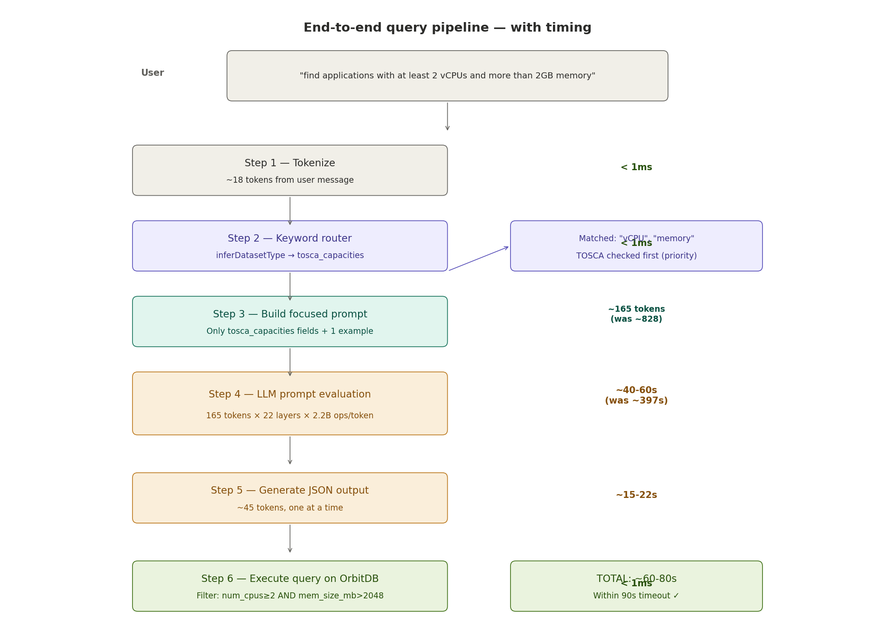
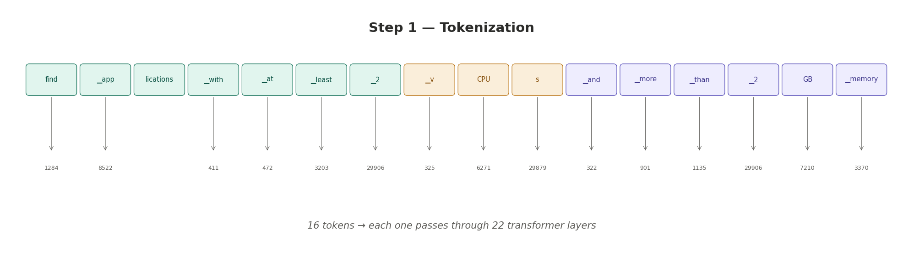
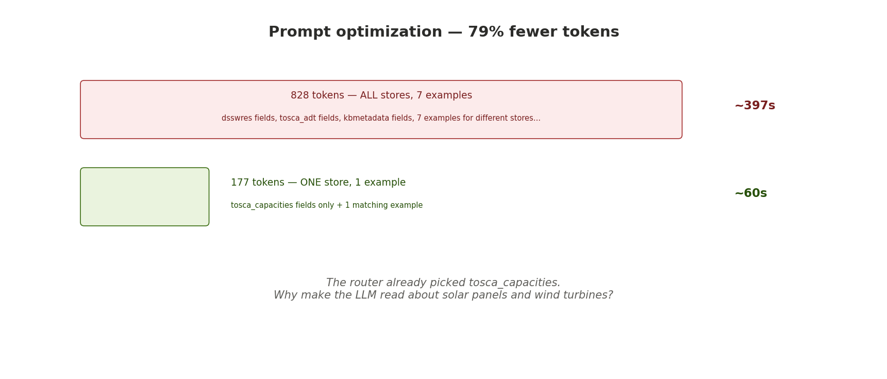
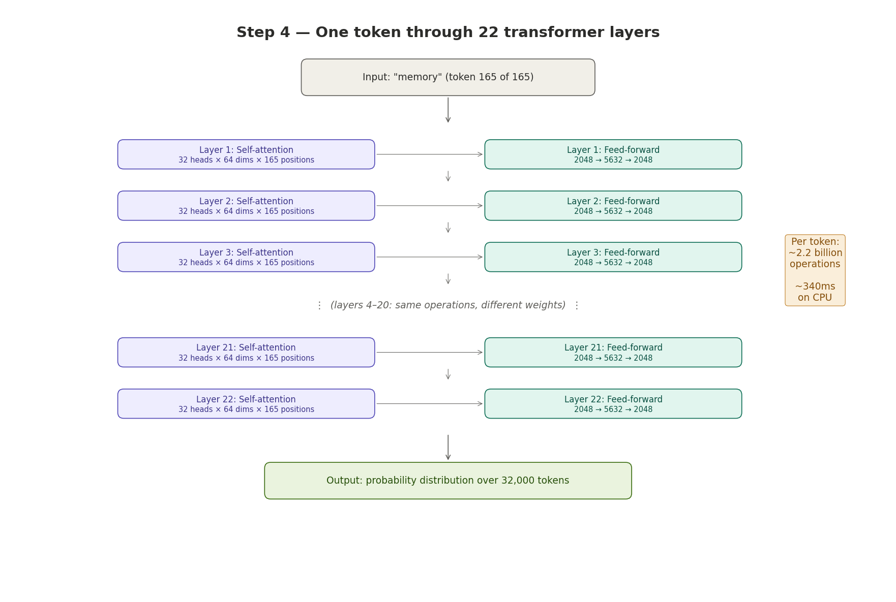
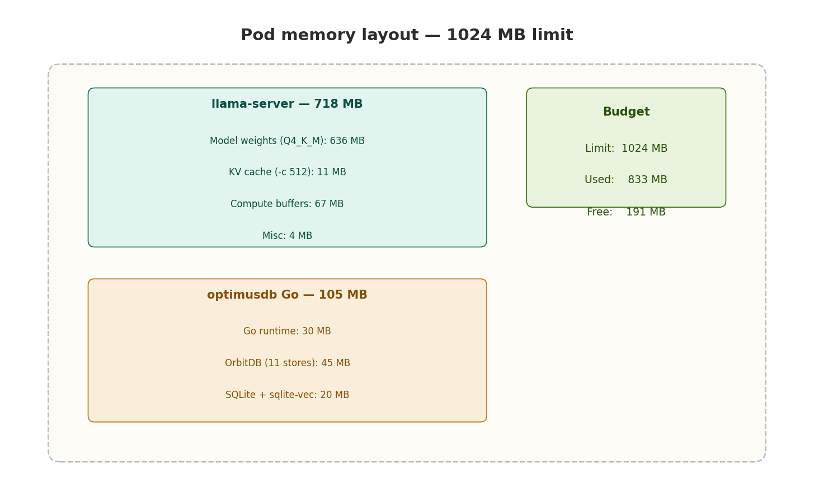

# How OptimusDB translates natural language to database queries

> A step-by-step walkthrough of what happens when a user asks a question,
> with precise calculations measured on the production cluster.

## The question

A user types into the chat endpoint:

```
"find applications with at least 2 vCPUs and more than 2GB memory"
```

What happens next involves six steps, four software components, and approximately 363 billion arithmetic operations — all to produce a single JSON filter that runs against an OrbitDB document store.



---

## Step 1 — Tokenization

**Time: < 1ms**

The user's sentence is plain text. The LLM doesn't understand text — it understands integer token IDs from a fixed vocabulary of 32,000 entries. The tokenizer splits the sentence into subword pieces and maps each to its ID:



| Text | Token ID |
|---|---|
| `find` | 1284 |
| `▁applications` | 8522 |
| `▁with` | 411 |
| `▁at` | 472 |
| `▁least` | 3203 |
| `▁2` | 29906 |
| `▁v` | 325 |
| `CPU` | 6271 |
| `s` | 29879 |
| `▁and` | 322 |
| `▁more` | 901 |
| `▁than` | 1135 |
| `▁2` | 29906 |
| `GB` | 7210 |
| `▁memory` | 3370 |

Result: **~18 tokens** from the user's message.

The `▁` prefix means "this token starts a new word" — it's how the tokenizer handles word boundaries without explicit spaces.

---

## Step 2 — Keyword routing

**Time: < 1ms** | **Code: `chat/handler.go` → `inferDatasetType()`**

Before involving the LLM, a fast regex router scans the lowercased message for domain-specific keywords to determine which of the 11 OrbitDB stores to query.

The words **"vCPU"** and **"memory"** match the TOSCA capacities pattern (checked first, before energy-domain patterns):

```go
if matched, _ := regexp.MatchString(
`\b(tosca|vcpu|vcpus|cpu|cpus|mem|memory|ram|gb|mb|vm|vms|gpu)\b`, message); matched {
return "tosca_capacities"
}
```

Result: **`dstype = "tosca_capacities"`**

This decision is critical for what comes next — it determines which fields the LLM prompt will contain.

---

## Step 3 — Build focused system prompt

**Time: < 1ms** | **Code: `chat/adapter.go` → `buildTranslationPrompt()`**

The system prompt teaches TinyLlama how to translate the user's question into structured JSON. Because the router already picked `tosca_capacities`, the prompt only includes that store's fields and one relevant example:

```
Translate the question to JSON query criteria.
Dataset: tosca_capacities
Fields: _id, num_cpus, mem_size, mem_size_mb, storage_gb, network_bandwidth_mbps, gpu_count
Format: {"command":"get|query","criteria":[{"field":"...","operator":"...","value":...}]}
Operators: ==, !=, >, >=, <, <=, contains
Q: "find applications with at least 2 vCPUs and more than 2GB memory"
A: {"command":"query","criteria":[{"field":"num_cpus","operator":">=","value":2},{"field":"mem_size_mb","operator":">","value":2048}]}
Rules: JSON only. No prose. Numbers unquoted. Strings quoted. Empty criteria for list/show all.
```

This prompt is wrapped in a chat template and combined with the user's message:

```
<|system|>
[system prompt above]
<|endoftext|>
<|user|>
find applications with at least 2 vCPUs and more than 2GB memory
<|endoftext|>
<|assistant|>
```

Total input: **~177 tokens** (10 template + 149 system prompt + 18 user message).



This focused prompt is 79% smaller than the original version (which included all 11 stores and 7 examples = ~828 tokens). The reduction is critical for performance — every token must pass through the full model before output generation begins.

---

## Step 4 — LLM prompt evaluation (the expensive step)

**Time: ~40-60 seconds** | **Code: `chat/adapter.go` → `translateWithTinyLlama()`**

This is where 99% of the computation happens. Every one of the 177 input tokens must pass through all 22 transformer layers of TinyLlama before the model can generate its first output token.



### What happens inside each layer

For each input token, each of the 22 layers performs two operations:

**Self-attention** — the token "looks at" every previous token to understand context. For the last token ("memory", position 165), this means:
- 32 attention heads, each with 64-dimensional keys and queries
- Each head computes attention scores against all 165 previous positions
- Computation: 32 × 64 × 165 = 337,920 multiply-add operations
- Total across all heads and dimensions: ~1.4 million operations

**Feed-forward network** — a two-layer neural network transforms the token's representation:
- First matrix: 2048 → 5632 (11.5 million multiply-adds)
- Second matrix: 5632 → 2048 (11.5 million multiply-adds)
- Total: ~23 million operations per layer

### The full cost

```
Per token, per layer:
Attention:    ~1.4 million operations
Feed-forward: ~23 million operations
Total:        ~24.4 million operations

Per token, all 22 layers:
24.4M × 22 = ~537 million operations

All 177 tokens:
537M × 177 = ~95 billion operations

At ~2 GFLOPS effective throughput (CPU, no GPU):
95B / 2B = ~47 seconds
```

**Measured on the production cluster: ~40-60 seconds** (varies with CPU load from other pods).

### Why the context window matters

The KV (key-value) cache stores intermediate results from previous tokens so each new token can attend to them. The cache size scales with context window:

| Context (-c) | KV cache size | Attention cost |
|---|---|---|
| 512 | 11 MB | Moderate — fits in L3 cache |
| 2048 | 44 MB | High — exceeds L3 cache, many memory stalls |

OptimusDB uses `-c 512` because the focused prompt + response fits in ~250 tokens. The smaller context window means faster attention and better CPU cache utilization.

---

## Step 5 — Token generation

**Time: ~15-22 seconds**

After processing all input tokens, the model generates the output JSON **one token at a time**. Each generated token becomes input for the next:

```
Token 1:  → "{"         (attend to 177 previous tokens)
Token 2:  → '"'         (attend to 178 previous tokens)
Token 3:  → "command"   (attend to 179 previous tokens)
Token 4:  → '"'
Token 5:  → ":"
Token 6:  → '"'
Token 7:  → "query"
Token 8:  → '"'
Token 9:  → ","
Token 10: → '"'
Token 11: → "criteria"
...
Token 45: → "}"         (final token — stop generation)
```

Each generated token requires a full pass through all 22 layers (same cost as prompt eval, but only 1 token at a time instead of 177). The KV cache avoids recomputing attention for previous tokens.

**Generation cost:**
```
45 tokens × 537M operations/token = ~24 billion operations
At ~2 GFLOPS: ~12 seconds
Measured: ~15-22 seconds (includes overhead)
```

**Complete LLM output:**
```json
{"command":"query","criteria":[
{"field":"num_cpus","operator":">=","value":2},
{"field":"mem_size_mb","operator":">","value":2048}
]}
```

The Go adapter parses this JSON and extracts the command type (`query`) and the filter criteria.

---

## Step 6 — Query execution

**Time: < 1ms** | **Code: `api/http.go` → `createKBQueryFunc()`**

The parsed criteria are applied as a filter function against the `tosca_capacities` OrbitDB document store:

```go
// Pseudocode of what the filter does for each document:
for each doc in tosca_capacities.AllDocuments() {
if doc["num_cpus"] >= 2 && doc["mem_size_mb"] > 2048 {
results = append(results, doc)
}
}
```

With 3 test documents in the store:

| Document | num_cpus | mem_size_mb | Matches? |
|---|---|---|---|
| Small web app | 1 | 512 | No — 1 < 2 |
| Medium API | 2 | 4096 | Yes — 2 ≥ 2 AND 4096 > 2048 |
| Large analytics | 8 | 16384 | Yes — 8 ≥ 2 AND 16384 > 2048 |

Result: **2 matching documents** returned in < 1ms.

---

## The response

The formatted response is returned to the user:

```json
{
"response": "Found **2** result(s):\n\n**1.** Medium API\n\n**2.** Large analytics\n\n",
"metadata": {
"query_type": "nlquery",
"dataset_type": "tosca_capacities",
"executed_cmd": "query",
"result_count": 2,
"confidence": 0.9
}
}
```

Every field in `metadata` is honest and verifiable: the `dataset_type` shows which store was queried, `executed_cmd` confirms a filter was applied (not a get-all), and `result_count` matches the actual number of documents returned.

---

## Total computation budget

| Step | Time | Operations | What happens |
|---|---|---|---|
| 1. Tokenize | < 1ms | Negligible | Split text into 18 token IDs |
| 2. Route | < 1ms | ~50 regex matches | Pick `tosca_capacities` from keywords |
| 3. Build prompt | < 1ms | String formatting | Assemble 177-token focused prompt |
| 4. Prompt eval | ~40-60s | **~95 billion** | 177 tokens × 22 layers × 537M ops/token |
| 5. Generate JSON | ~15-22s | **~24 billion** | 45 tokens × 22 layers × 537M ops/token |
| 6. Execute query | < 1ms | ~100 comparisons | Filter 3 documents by 2 criteria |
| **Total** | **~60-80s** | **~119 billion** | |

Step 4 (prompt evaluation) dominates at ~80% of total time. This is why the focused prompt optimization — reducing input tokens from 828 to 177 — has the largest impact on query latency.

---

## Memory layout



Each OptimusDB pod runs two processes within a 1024 MB memory limit:

| Component | Memory | Purpose |
|---|---|---|
| **Model weights** | 636 MB | TinyLlama 1.1B Q4_K_M — the neural network parameters |
| **KV cache** | 11 MB | Intermediate attention state (at -c 512) |
| **Compute buffers** | 67 MB | Scratch space for matrix operations |
| **Go application** | 105 MB | OrbitDB, SQLite, LibP2P, HTTP server |
| **OS / supervisord** | 10 MB | Process management |
| **Free headroom** | 191 MB | Available for spikes |

---

## TinyLlama 1.1B architecture reference

These numbers come directly from the model metadata reported by llama-server at startup:

| Parameter | Value | What it means |
|---|---|---|
| `n_layer` | 22 | Number of transformer blocks — each token passes through all 22 |
| `n_embd` | 2048 | Embedding dimension — the "width" of the model's internal representation |
| `n_head` | 32 | Attention heads — parallel attention computations per layer |
| `n_head_kv` | 4 | KV heads (Grouped-Query Attention) — memory-efficient attention |
| `n_ff` | 5632 | Feed-forward hidden size — the "thinking" width inside each layer |
| `n_vocab` | 32,000 | Vocabulary size — number of possible tokens |
| `n_ctx_train` | 2048 | Maximum context the model was trained on |
| Model size | 636 MB | Quantized to Q4_K_M (4 bits per weight, medium quality) |
| Parameters | 1.1 billion | Total trainable parameters |

### What quantization does

The original TinyLlama model uses 16-bit floating point weights (2 bytes each), requiring ~2.2 GB of memory. Q4_K_M quantization compresses each weight to ~4.85 bits, reducing memory to 636 MB — a 3.5× reduction with minimal quality loss.

---

## What determines query speed

Three factors control how fast a query completes, in order of impact:

### 1. Number of input tokens (~80% of total time)

This is the **system prompt size**. The focused prompt sends only the relevant store's fields and one example (~149 tokens). The original prompt sent all 11 stores with 7 examples (~800 tokens). Reducing input tokens has a linear effect on prompt eval time.

### 2. Context window size (~15% impact)

The `-c` parameter sets the maximum sequence length. Self-attention is O(n²) with context length — each token computes attention scores against all previous tokens. At `-c 512`, the attention window is 4× smaller than at `-c 2048`, and the KV cache (11 MB vs 44 MB) fits better in CPU cache.

### 3. Available CPU cores (~5% impact)

llama.cpp parallelizes matrix multiplications across available cores. With 2 cores (current allocation), prompt eval runs ~1.8× faster than with 1 core. Adding more cores has diminishing returns — the memory bandwidth bottleneck limits scaling beyond 4 cores for this model size.

---

## Model comparison: what if you upgrade?

The pipeline code works with any model served by llama-server. Only the model file and memory allocation need to change.

| Model | Parameters | Layers | Memory | Query time (est.) | Accuracy |
|---|---|---|---|---|---|
| **TinyLlama 1.1B** (current) | 1.1B | 22 | 718 MB | ~60-80s | ~70% |
| Qwen2.5-1.5B | 1.5B | 28 | ~1 GB | ~90-120s | ~80% |
| Phi-2 | 2.7B | 32 | ~1.5 GB | ~150-200s | ~85% |
| Qwen2.5-3B | 3B | 36 | ~2 GB | ~180-240s | ~85% |

"Accuracy" means the percentage of queries where the LLM produces correct field names and operators. TinyLlama at ~70% means roughly 3 in 10 queries will use wrong field names or operators, causing the filter to return all documents instead of a filtered subset. The pipeline handles this gracefully — wrong criteria never cause crashes, they just return too many results.

To upgrade: change the `-m` flag in the Dockerfile, increase the pod memory limit in the K8s manifest, and redeploy. No Go code changes required.
